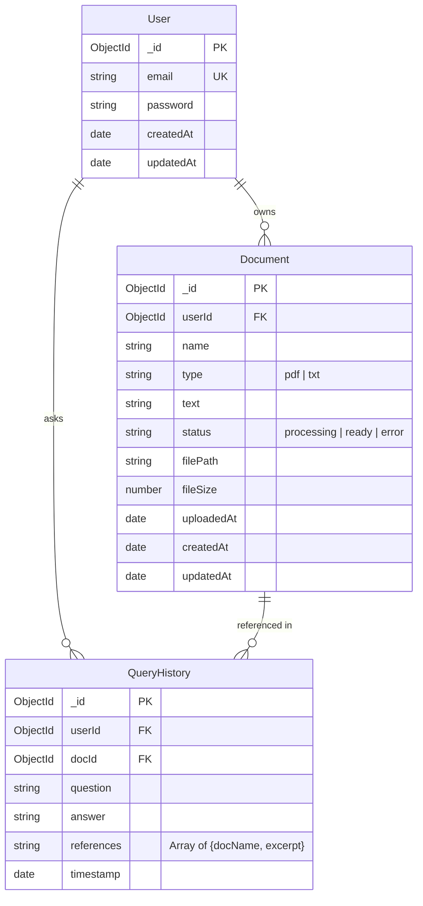

# Doc-HuB

**A Full-Stack MERN Application with AI-Powered Document Q&A**

**Live Demo**: https://doc-hu-b.vercel.app

**Backend**: https://doc-hub-l8f7.onrender.com

### Features

- **Authentication** — Secure Login & Signup with JWT
- **Document Upload** — Supports **PDF, TXT** files
- **Smart Text Extraction** — content extraction
- **AI Question Answering** — Powered by **Google Gemini 2.5 Flash** ( free model 2025)
- **RAG Implementation** — Answers based **only** on your uploaded documents
- **Document References** — Every answer shows source document + excerpt
- **Query History** — View all past questions grouped by document
- **Beautiful UI** — Modern Tailwind CSS design
- **Production Deployed** — Render.com (backend) + Vercel (frontend)

---

### Tech Stack

| Layer       | Technology                               |
| ----------- | ---------------------------------------- |
| Frontend    | React.js + Tailwind CSS + Axios          |
| Backend     | Node.js + Express.js                     |
| Database    | MongoDB (Atlas)                          |
| AI Engine   | Google Gemini 2.5 Flash (Free Tier)      |
| Auth        | JWT + bcrypt                             |
| File Parser | pdf-parse                                |
| Deployment  | Render.com (Backend) + Vercel (Frontend) |

---

### How to Run Locally

#### Prerequisites

- Node.js (v18+)
- MongoDB Atlas account
- Google Gemini API Key (free): https://aistudio.google.com/app/apikey

#### 1. Clone the repo

git clone https://github.com/Pavanteja-001/Doc-HuB

cd Doc-HuB

#### 2.Backend Setup

cd backend
npm install

#### Create .env file:

MONGO_URI=your_mongodb_atlas_connection_string
JWT_SECRET=your_very_long_random_secret_here_123456789
GEMINI_API_KEY=AIzaSyxxxxxxxxxxxxxxxxxxxxxxxxxxxxxxxxxx

PORT=5001

Start backend:
node server.js

#### 4.Frontend Setup

cd ../frontend

npm install
npm start

Open
http://localhost:3000

### API Routes & Implementation

All routes are prefixed with:

- `/auth` → Authentication
- `/docs` → Document & AI operations

| Method   | Endpoint        | Auth Required | Description                                  | Request Body / Params             | Success Response                            |
| -------- | --------------- | ------------- | -------------------------------------------- | --------------------------------- | ------------------------------------------- |
| `POST`   | `/auth/signup`  | No            | Create new user                              | `{ email, password }`             | `{ token }`                                 |
| `POST`   | `/auth/login`   | No            | Login user                                   | `{ email, password }`             | `{ token }`                                 |
| `POST`   | `/docs/upload`  | Yes           | Upload PDF/TXT + extract text                | `multipart/form-data` with `file` | `{ message, documentId, name, textLength }` |
| `GET`    | `/docs/list`    | Yes           | Get all user documents                       | -                                 | Array of documents                          |
| `DELETE` | `/docs/:id`     | Yes           | Delete a document                            | Document ID in URL                | `{ message: "Deleted successfully" }`       |
| `POST`   | `/docs/ask`     | Yes           | Ask AI question about all uploaded documents | `{ question }`                    | `{ answer, references[] }`                  |
| `GET`    | `/docs/history` | Yes           | Get full query history (all documents)       | -                                 | Array of query objects                      |

### Database Schema Design (with Relationships)

###### Observations & Explanation of Limitations During Implementation

During the development of this, the core functionalities such as authentication, document upload, text extraction, storage in MongoDB, dashboard setup, chat-style querying, and AI-based answering using stored content were successfully implemented. However, the advanced RAG-based vector search pipeline could not be completed due to several practical limitations encountered during testing.
Our main blocker was inconsistent text extraction from PDFs. Many documents produced noisy or partially unreadable text after parsing, which made chunking unreliable. Since embeddings depend fully on clean and structured text, the extracted content frequently caused invalid embeddings, leading to poor or meaningless semantic representations. When attempting batch embedding using available AI APIs, also faced repeated token-limit issues, unexpected rate-limit errors, and cost spikes, making the embedding pipeline unstable and non-repeatable within the given constraints.
Because of these extraction and embedding failures, we were unable to generate a stable dataset of vectors to index in MongoDB Atlas. As a result, the vector search stage using $vectorSearch could not be activated or tested end-to-end. This forms the major limitation of the current system.
Despite this, the implemented solution still meets the core requirements of the assignment. The system successfully extracts text, stores documents, answers questions strictly from stored content, and provides references and history. The vector-enhanced semantic search remains a future enhancement that requires more reliable extraction, stable chunking logic, and a controlled embedding pipeline.
